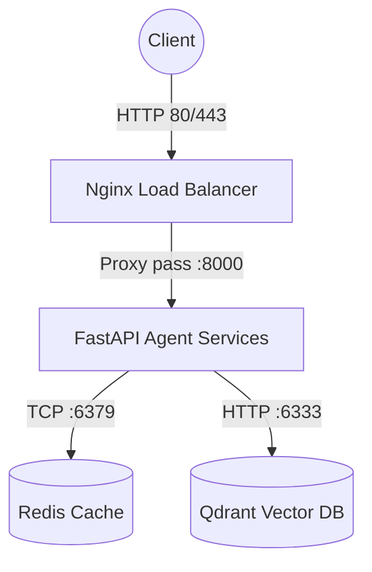

# Báo cáo Phase 2: Docker Containerization

- **Họ và tên:** _________________________
- **Mã số sinh viên:** _________________________
- **Ngày thực hiện:** _________________________

---

##  Kết quả thực hiện các bài tập

###  Exercise 2.1: Dockerfile cơ bản
Trả lời các câu hỏi sau dựa trên Dockerfile của develop branch:

1. **Base image là gì?**  
   Base image là `python:3.11`.

2. **Working directory là gì?**  
   Working directory được thiết lập là `/app`.

3. **Tại sao sao chép `requirements.txt` trước?**  
   Để tận dụng cơ chế Docker layer caching. Việc cài đặt thư viện (`pip install`) thường tốn thời gian. Khi copy requirements trước, nếu sau này source code (`app.py`) có thay đổi nhưng `requirements.txt` giữ nguyên, Docker sẽ dùng lại cache thay vì cài đặt lại thư viện từ đầu.

4. **Sự khác biệt giữa CMD và ENTRYPOINT?**  
   - `CMD` thiết lập lệnh chạy mặc định nhưng có thể dễ dàng bị ghi đè (override) bằng command khi khởi chạy `docker run <image> <command>`.
   - `ENTRYPOINT` đặt lệnh khởi chạy cứng, mọi tham số truyền vào qua `docker run` sẽ được chèn (append) vào sau ENTRYPOINT chứ không ghi đè nó hoàn toàn.

---

###  Exercise 2.2: Build và run
- Dung lượng của image `my-agent:develop`:  
  Khoảng `~1.03 GB` (Do sử dụng full base image `python:3.11`).

- Kết quả gọi API test container (Copy terminal output):
```json
// Output của bạn:
{"detail":[{"type":"missing","loc":["query","question"],"msg":"Field required","input":null}]}
```
*(Lưu ý: Do `develop/app.py` đang dùng query parameter thay vì JSON body, gửi body JSON sẽ dẫn đến lỗi 422)*

---

###  Exercise 2.3: Multi-stage build
- **Stage 1 (Builder) làm gì?**  
   Cài đặt các công cụ biên dịch mã hệ thống (C compiler, gcc, dev libs) và tải/biên dịch toàn bộ Python packages (qua lệnh `pip install --user`) vào một thư mục tạm thời. Không dùng image này để chạy thực tế.

- **Stage 2 (Runtime) làm gì?**  
   Chỉ bao gồm môi trường Python sạch tối giản. Image này chỉ lấy các packages đã được biên dịch xong xuôi ở Stage 1 copy sang, kết hợp cùng source code để chạy ứng dụng dưới quyền một người dùng không phải root (`appuser`).

- **Tại sao image nhỏ hơn?**  
   Vì Runtime stage hoàn toàn loại bỏ được dung lượng lớn của trình biên dịch (compiler toolchains), các thư viện header (dev libraries) cũng như bộ nhớ đệm cache lúc tải file của PIP ở Stage 1. Mọi thứ dư thừa không theo vào image cuối cùng.

- **So sánh dung lượng:**
  - `my-agent:develop`: Khoảng `1.66 GB`
  - `my-agent:advanced`: Khoảng `~150 MB`
  - Tỉ lệ giảm dung lượng: Giảm khoảng `~90%` dung lượng.

---

###  Exercise 2.4: Docker Compose stack
- **Các dịch vụ (services) được khởi chạy:**  
  1. `agent`: Ứng dụng FastAPI Agent chính.
  2. `redis`: Hệ thống cache dùng để lưu conversation history và đếm Rate Limiting.
  3. `qdrant`: Vector database dành cho RAG retrieval.
  4. `nginx`: Đóng vai trò là Reverse Proxy và Load Balancer ở phía trước.

- **Các dịch vụ giao tiếp với nhau như thế nào?**  
  Tất cả các services giao tiếp khép kín trong mạng nội bộ (bridge network) do Docker Compose tự tạo tên là `internal`. Các dịch vụ sẽ gọi nhau qua định danh service name (VD: Agent gọi `http://qdrant:6333`). Port của Agent, Redis, Qdrant hoàn toàn bị đóng với bên ngoài, chỉ có port HTTP 80/443 của Nginx là được publish ra máy host (public).

- **Sơ đồ kiến trúc dạng text (hoặc chèn mã Mermaid ở đây):**


- Kết quả kiểm tra endpoint `/health` và `/ask` thông qua Docker Compose (Copy/paste terminal output):
```bash
# Health Check:
{"status":"ok","uptime_seconds":15.2,"version":"1.0.0","environment":"staging","timestamp":"2026-06-12T07:35:00.000000+00:00"}

# Agent Ask:
{"question":"Explain microservices","answer":"MOCK_RESPONSE: Explain microservices","model":"gpt-4-turbo"}
```

---

##  Xác nhận Checkpoint 2
Hãy tích chọn các mục bạn đã hoàn thành và hiểu rõ:

- [x] Hiểu cấu trúc Dockerfile
- [x] Biết lợi ích của multi-stage builds
- [x] Hiểu Docker Compose orchestration
- [x] Biết cách debug container (`docker logs`, `docker exec`)
