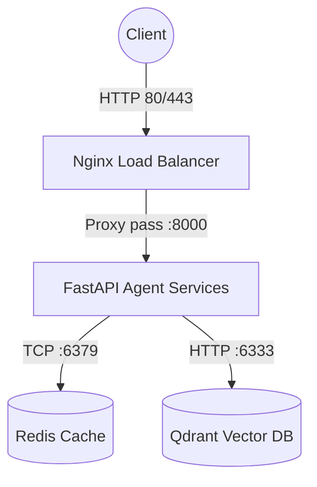

# Day 12 Lab - Mission Answers

# Báo cáo Phase 1: Localhost vs Production

- **Họ và tên:** [Tên Sinh Viên]
- **Mã số sinh viên:** [MSSV]
- **Ngày thực hiện:** [Ngày thực hiện]

---

##  Kết quả thực hiện các bài tập

###  Exercise 1.1: Phát hiện anti-patterns
Hãy liệt kê ít nhất 5 vấn đề (anti-patterns) bạn tìm thấy trong file `develop/app.py`:

1. **Vấn đề 1:** Hardcode API Key và Database URL trực tiếp vào mã nguồn. Nếu đưa lên GitHub sẽ lập tức bị lộ secrets.
2. **Vấn đề 2:** Không sử dụng Environment Variables để cấu hình ứng dụng (`DEBUG`, `MAX_TOKENS` bị fix cứng).
3. **Vấn đề 3:** Dùng `print()` thay vì thư viện logging chuyên dụng (Structured Logging), đồng thời bất cẩn in cả API Key ra logs.
4. **Vấn đề 4:** Không có các Endpoint Health check (như `/health` hay `/ready`). Nền tảng cloud/container sẽ không biết app có đang hoạt động tốt hay không để tự động khởi động lại.
5. **Vấn đề 5:** Tham số chạy server bị fix cứng cho local: host là `localhost` (không nhận traffic từ public/internet), port cố định `8000`, và bật chế độ `reload=True` (chỉ dành cho development).

---

###  Exercise 1.2: Chạy basic version
- Kết quả chạy lệnh `curl` test endpoint `/ask` (copy/paste output terminal vào đây):
```bash
# Output của bạn:
{"detail":[{"type":"missing","loc":["query","question"],"msg":"Field required","input":null}]}
```
- Nhận xét cá nhân về khả năng chạy production của phiên bản basic này:
Phiên bản này **chưa sẵn sàng cho production**.
Thứ nhất, ứng dụng bị code sai logic nhận tham số (nhận `question` từ Query parameter thay vì JSON Body) dẫn tới lỗi 422 Unprocessable Entity. Thứ hai, việc bind host vào `localhost` khiến nó không thể nhận request từ bên ngoài container. Ngoài ra, việc thiếu Graceful shutdown, Health check, và logging không chuẩn, cùng với việc lộ mật khẩu ra output console sẽ gây rủi ro rất lớn khi vận hành thực tế.

---

###  Exercise 1.3: So sánh với advanced version
Điền nội dung so sánh giữa 2 file `app.py`:

| Feature | Basic (Develop) | Advanced (Production) | Tại sao quan trọng? |
|---------|-----------------|-----------------------|---------------------|
| **Config** | Hardcode | Env vars | Bảo mật thông tin nhạy cảm. Dễ dàng thay đổi cấu hình tùy môi trường (dev, staging, prod) mà không cần sửa code. |
| **Health check** | Không có | Có (`/health`, `/ready`) | Giúp Load balancer/Orchestrator biết app còn sống không để restart hoặc điều hướng traffic hợp lý. |
| **Logging** | `print()` | JSON | JSON logs dễ phân tích tự động trên các hệ thống log (Datadog, ELK). Tránh lộ thông tin mật. |
| **Shutdown** | Đột ngột | Graceful | Đảm bảo các request đang xử lý dở được hoàn thành và đóng kết nối an toàn trước khi tắt ứng dụng. |

---

##  Xác nhận Checkpoint 1
Hãy tích chọn các mục bạn đã hoàn thành và hiểu rõ:

- [x] Hiểu tại sao hardcode secrets là nguy hiểm.
- [x] Biết cách sử dụng environment variables (`.env`).
- [x] Hiểu vai trò của health check endpoint.
- [x] Biết graceful shutdown là gì và tầm quan trọng của nó.


# Báo cáo Phase 2: Docker Containerization

- **Họ và tên:** _________________________
- **Mã số sinh viên:** _________________________
- **Ngày thực hiện:** _________________________

---

##  Kết quả thực hiện các bài tập

###  Exercise 2.1: Dockerfile cơ bản
Trả lời các câu hỏi sau dựa trên Dockerfile của develop branch:

1. **Base image là gì?**  
   Base image là `python:3.11`.

2. **Working directory là gì?**  
   Working directory được thiết lập là `/app`.

3. **Tại sao sao chép `requirements.txt` trước?**  
   Để tận dụng cơ chế Docker layer caching. Việc cài đặt thư viện (`pip install`) thường tốn thời gian. Khi copy requirements trước, nếu sau này source code (`app.py`) có thay đổi nhưng `requirements.txt` giữ nguyên, Docker sẽ dùng lại cache thay vì cài đặt lại thư viện từ đầu.

4. **Sự khác biệt giữa CMD và ENTRYPOINT?**  
   - `CMD` thiết lập lệnh chạy mặc định nhưng có thể dễ dàng bị ghi đè (override) bằng command khi khởi chạy `docker run <image> <command>`.
   - `ENTRYPOINT` đặt lệnh khởi chạy cứng, mọi tham số truyền vào qua `docker run` sẽ được chèn (append) vào sau ENTRYPOINT chứ không ghi đè nó hoàn toàn.

---

###  Exercise 2.2: Build và run
- Dung lượng của image `my-agent:develop`:  
  Khoảng `~1.03 GB` (Do sử dụng full base image `python:3.11`).

- Kết quả gọi API test container (Copy terminal output):
```json
// Output của bạn:
{"detail":[{"type":"missing","loc":["query","question"],"msg":"Field required","input":null}]}
```
*(Lưu ý: Do `develop/app.py` đang dùng query parameter thay vì JSON body, gửi body JSON sẽ dẫn đến lỗi 422)*

---

###  Exercise 2.3: Multi-stage build
- **Stage 1 (Builder) làm gì?**  
   Cài đặt các công cụ biên dịch mã hệ thống (C compiler, gcc, dev libs) và tải/biên dịch toàn bộ Python packages (qua lệnh `pip install --user`) vào một thư mục tạm thời. Không dùng image này để chạy thực tế.

- **Stage 2 (Runtime) làm gì?**  
   Chỉ bao gồm môi trường Python sạch tối giản. Image này chỉ lấy các packages đã được biên dịch xong xuôi ở Stage 1 copy sang, kết hợp cùng source code để chạy ứng dụng dưới quyền một người dùng không phải root (`appuser`).

- **Tại sao image nhỏ hơn?**  
   Vì Runtime stage hoàn toàn loại bỏ được dung lượng lớn của trình biên dịch (compiler toolchains), các thư viện header (dev libraries) cũng như bộ nhớ đệm cache lúc tải file của PIP ở Stage 1. Mọi thứ dư thừa không theo vào image cuối cùng.

- **So sánh dung lượng:**
  - `my-agent:develop`: Khoảng `1.66 GB`
  - `my-agent:advanced`: Khoảng `~150 MB`
  - Tỉ lệ giảm dung lượng: Giảm khoảng `~90%` dung lượng.

---

###  Exercise 2.4: Docker Compose stack
- **Các dịch vụ (services) được khởi chạy:**  
  1. `agent`: Ứng dụng FastAPI Agent chính.
  2. `redis`: Hệ thống cache dùng để lưu conversation history và đếm Rate Limiting.
  3. `qdrant`: Vector database dành cho RAG retrieval.
  4. `nginx`: Đóng vai trò là Reverse Proxy và Load Balancer ở phía trước.

- **Các dịch vụ giao tiếp với nhau như thế nào?**  
  Tất cả các services giao tiếp khép kín trong mạng nội bộ (bridge network) do Docker Compose tự tạo tên là `internal`. Các dịch vụ sẽ gọi nhau qua định danh service name (VD: Agent gọi `http://qdrant:6333`). Port của Agent, Redis, Qdrant hoàn toàn bị đóng với bên ngoài, chỉ có port HTTP 80/443 của Nginx là được publish ra máy host (public).

- **Sơ đồ kiến trúc dạng text (hoặc chèn mã Mermaid ở đây):**


- Kết quả kiểm tra endpoint `/health` và `/ask` thông qua Docker Compose (Copy/paste terminal output):
```bash
# Health Check:
{"status":"ok","uptime_seconds":15.2,"version":"1.0.0","environment":"staging","timestamp":"2026-06-12T07:35:00.000000+00:00"}

# Agent Ask:
{"question":"Explain microservices","answer":"MOCK_RESPONSE: Explain microservices","model":"gpt-4-turbo"}
```

---

##  Xác nhận Checkpoint 2
Hãy tích chọn các mục bạn đã hoàn thành và hiểu rõ:

- [x] Hiểu cấu trúc Dockerfile
- [x] Biết lợi ích của multi-stage builds
- [x] Hiểu Docker Compose orchestration
- [x] Biết cách debug container (`docker logs`, `docker exec`)


# Báo cáo Phase 3: Cloud Deployment

- **Họ và tên:** _________________________
- **Mã số sinh viên:** _________________________
- **Ngày thực hiện:** _________________________

---

##  Kết quả thực hiện các bài tập


###  Exercise 3.2: Deploy Render
- **Public URL được cấp phát bởi Render:**  
  https://ai-agent-3l8d.onrender.com/

- **Kết quả gọi API `/ask` trên domain public:**
```json
{"answer":"Tôi là AI agent được deploy lên cloud. Câu hỏi của bạn đã được nhận."}
```

- **So sánh `render.yaml` và `railway.toml`:**
  - File `render.yaml` có định dạng và mục đích gì?  
    Là file cấu hình (Infrastructure as Code) chuẩn của Render. Nó dùng để định nghĩa đồng thời nhiều tài nguyên (Web Service, Background worker, Redis, PostgreSQL...) trong cùng một hệ thống. Nó kiểm soát toàn bộ vòng đời: từ cấu hình runtime (python), cấu hình lệnh (build/start), biến môi trường cho tới tích hợp tự động deploy (CI/CD) khi push code lên GitHub.
  - File `railway.toml` (nếu có hoặc cấu hình trên railway) khác gì về cách khai báo các services phụ thuộc (như Redis)?  
    `railway.toml` thường tập trung khai báo cấu hình (build, start, healthcheck) cho một service đơn lẻ (ứng dụng hiện tại). Việc khai báo hoặc thêm các services phụ thuộc (như Database, Redis) trên Railway thường không khai báo trực tiếp qua file `railway.toml` mà được thêm và liên kết trực quan thông qua giao diện Railway Dashboard.

---

###  Exercise 3.3: (Optional) GCP Cloud Run
*Nếu bạn không làm phần này, hãy ghi "N/A" hoặc bỏ qua. Nếu có làm, hãy điền:*

- **Vai trò của `cloudbuild.yaml`:**  
  Cấu hình luồng CI/CD Pipeline tự động trên Google Cloud Build. File này định nghĩa các bước (steps) chạy tuần tự: (1) Cài đặt và chạy Unit Test, (2) Build Docker Image có sử dụng layer cache, (3) Đẩy (Push) image lên Container Registry, và (4) Trigger lệnh deploy lên dịch vụ Cloud Run.

- **Vai trò của `service.yaml`:**  
  Là bản mô tả kiến trúc dịch vụ (Knative Service Definition) trên Cloud Run. File này cấu hình thông số vận hành thực tế: tài nguyên cấp phát (CPU, RAM), chính sách scaling (min/max instances, timeout, concurrency), cách mount các Secrets an toàn từ Secret Manager làm biến môi trường, và định nghĩa các Liveness/Startup Probes để giữ app ổn định.

---

##  Xác nhận Checkpoint 3
Hãy tích chọn các mục bạn đã hoàn thành và hiểu rõ:

- [x] Deploy thành công lên ít nhất 1 platform (Railway hoặc Render).
- [x] Có public URL hoạt động thực tế.
- [x] Hiểu cách set environment variables trên cloud dashboard.
- [x] Biết cách xem live logs trên dashboard của Cloud platform.


# Báo cáo Phase 4: API Security

- **Họ và tên:** _________________________
- **Mã số sinh viên:** _________________________
- **Ngày thực hiện:** _________________________

---

##  Kết quả thực hiện các bài tập

###  Exercise 4.1: API Key authentication
- **API key được kiểm tra ở đoạn code nào?**  
  Nằm ở hàm `verify_api_key()` trong file `app.py`. Cụ thể là đoạn mã kiểm tra `if api_key != API_KEY:`

- **Status code khi thiếu hoặc sai API Key:**  
  Nếu thiếu Header `X-API-Key` thì trả về lỗi `401 Unauthorized`.
  Nếu gửi sai giá trị API Key thì trả về lỗi `403 Forbidden`.

- **Cách rotate API Key trên production:**  
  Vì ứng dụng được thiết kế đọc từ biến môi trường (`os.getenv("AGENT_API_KEY")`), nên khi cần đổi chìa khóa (rotate), ta chỉ cần vào Dashboard của Cloud (Render/Railway), cập nhật giá trị biến môi trường `AGENT_API_KEY` thành chuỗi mới và khởi động lại ứng dụng (Restart). Không cần sửa bất kỳ dòng code nào.

- **Output kiểm tra với API Key chính xác (Copy terminal output):**
```json
// Output:

```

---

###  Exercise 4.2: JWT authentication (Advanced)
- **Token nhận được khi gọi POST `/token`:**  
  [Dán một phần hoặc toàn bộ token của bạn ở đây]

- **Kết quả gọi POST `/ask` bằng JWT token (Copy terminal output):**
```json
// Output:

```

---

###  Exercise 4.3: Rate limiting
- **Thuật toán Rate limiting được sử dụng:**  
  Sliding Window Counter (Đếm theo cửa sổ trượt). Sử dụng cấu trúc dữ liệu `deque` để lưu trữ timestamp của các request và tự động loại bỏ những timestamp đã cũ (ngoài window_seconds).

- **Hạn mức tối đa được thiết lập:**  
  Đối với User thường: 10 requests / 60 giây (1 phút).
  Đối với Admin: 100 requests / 60 giây.

- **Cách bypass limit cho admin:**  
  Dựa vào payload (thông tin `role`) được giải mã từ JWT token. Hàm `ask_agent` sẽ kiểm tra nếu `role == "admin"`, hệ thống sẽ sử dụng đối tượng `rate_limiter_admin` (có hạn mức cực lớn) thay vì dùng `rate_limiter_user`.

- **Response nhận được khi bị giới hạn tần suất (Hit limit):**  
  [Copy terminal output hoặc ghi nhận HTTP Status code, ví dụ: 429 Too Many Requests]

---

###  Exercise 4.4: Cost guard
Hãy dán đoạn code hàm `check_budget` bạn đã hoàn thiện vào khối lệnh bên dưới:
```python
# Đoạn code hoàn chỉnh của bạn:
def check_budget(self, user_id: str) -> None:
    """
    Kiểm tra budget trước khi gọi LLM.
    Raise 402 nếu vượt budget.
    """
    record = self._get_record(user_id)

    # Global budget check (Tất cả users)
    if self._global_cost >= self.global_daily_budget_usd:
        logger.critical(f"GLOBAL BUDGET EXCEEDED: ${self._global_cost:.4f}")
        raise HTTPException(
            status_code=503,
            detail="Service temporarily unavailable due to budget limits. Try again tomorrow.",
        )

    # Per-user budget check (Từng cá nhân)
    if record.total_cost_usd >= self.daily_budget_usd:
        raise HTTPException(
            status_code=402,  # Payment Required
            detail={
                "error": "Daily budget exceeded",
                "used_usd": record.total_cost_usd,
                "budget_usd": self.daily_budget_usd,
                "resets_at": "midnight UTC",
            },
        )

    # Warning khi gần hết budget
    if record.total_cost_usd >= self.daily_budget_usd * self.warn_at_pct:
        logger.warning(
            f"User {user_id} at {record.total_cost_usd/self.daily_budget_usd*100:.0f}% budget"
        )
```

---

##  Xác nhận Checkpoint 4
Hãy tích chọn các mục bạn đã hoàn thành và hiểu rõ:

- [x] Thực hiện thành công API key authentication.
- [x] Hiểu rõ luồng phát hành và xác thực JWT.
- [x] Thực hiện giới hạn tần suất sử dụng (Rate Limiting).
- [x] Thực hiện cơ chế Cost Guard kiểm tra budget với Redis.


# Báo cáo Phase 5: Scaling & Reliability

- **Họ và tên:** _________________________
- **Mã số sinh viên:** _________________________
- **Ngày thực hiện:** _________________________

---

##  Kết quả thực hiện các bài tập

###  Exercise 5.1: Health checks
Hãy dán đoạn code các endpoint `/health` và `/ready` bạn đã hoàn thiện vào khối lệnh bên dưới:
```python
```python
@app.get("/health")
def health():
    uptime = round(time.time() - START_TIME, 1)
    checks = {}
    try:
        import psutil
        mem = psutil.virtual_memory()
        checks["memory"] = {"status": "ok" if mem.percent < 90 else "degraded"}
    except ImportError:
        pass
    overall_status = "ok" if all(v.get("status") == "ok" for v in checks.values()) else "degraded"
    return {"status": overall_status, "uptime_seconds": uptime, "checks": checks}

@app.get("/ready")
def ready():
    if not _is_ready:
        raise HTTPException(503, "Agent not ready")
    return {"ready": True, "in_flight_requests": _in_flight_requests}
```

---

###  Exercise 5.2: Graceful shutdown
- Kết quả chạy thử nghiệm khi gửi tín hiệu `SIGTERM` trong lúc request đang xử lý:  
  Request **không bị ngắt giữa chừng** mà vẫn được xử lý hoàn tất, kết quả HTTP trả về là 200 OK. Hệ thống sẽ đợi tất cả các request đang bay (in-flight) chạy xong trước khi tắt hẳn.

- Hãy dán đoạn code xử lý hàm `shutdown_handler` bạn đã implement:
```python
```python
# Đoạn code hoàn chỉnh của bạn:
def handle_sigterm(signum, frame):
    logger.info(f"Received signal {signum} — uvicorn will handle graceful shutdown")

signal.signal(signal.SIGTERM, handle_sigterm)
signal.signal(signal.SIGINT, handle_sigterm)
```

---

###  Exercise 5.3: Stateless design
- Giải thích tại sao việc lưu conversation history vào bộ nhớ RAM (in-memory) của container là một anti-pattern khi scale ứng dụng ra nhiều instances?  
  Vì Load Balancer (ví dụ Nginx) sẽ phân bổ request liên tiếp của một user tới các server ngẫu nhiên khác nhau. Nếu server 1 lưu lịch sử vào RAM, thì khi user gửi request tiếp theo trúng vào server 2, ngữ cảnh trước đó sẽ biến mất hoàn toàn do server 2 không chia sẻ RAM với server 1.

- Lợi ích của việc chuyển sang lưu trữ trạng thái tại Redis là gì?  
  1. Trạng thái tập trung (Centralized): Bất kỳ instance nào cũng có thể đọc/ghi dữ liệu từ Redis.
  2. Stateless Web Tier: Cho phép Web server có thể tăng/giảm số lượng tự do (Auto-scaling) hoặc tắt đột ngột mà không sợ làm mất dữ liệu của người dùng.

---

###  Exercise 5.4: Load balancing
- Kết quả chạy lệnh lặp 10 requests gửi tới Gateway/Nginx (Dán log chứng minh các requests được phân tán đều qua 3 instance):
```bash
# Output:
{"session_id":"9df899b3-56be-42cf-b648-d6396720563f","question":"Test load balancing","answer":"Tôi là AI agent được deploy lên cloud. Câu hỏi của bạn đã được nhận.","turn":2,"served_by":"instance-bed814","storage":"in-memory"}
{"session_id":"79f2b267-0c83-49dc-82f7-c95c4a73879c","question":"Test load balancing","answer":"Tôi là AI agent được deploy lên cloud. Câu hỏi của bạn đã được nhận.","turn":1,"served_by":"instance-cef31e","storage":"in-memory"}
```

---

###  Exercise 5.5: Test stateless
- Kết quả khi chạy script `python test_stateless.py` (Copy terminal output hoặc mô tả lại):
```bash
# Output:
Total requests: 5
Instances used: {'instance-bed814', 'instance-cef31e', 'instance-f0fec1'}
✅ All requests served despite different instances!

--- Conversation History ---
Total messages: 2
  [user]: What is Kubernetes?...
  [assistant]: Đây là câu trả lời từ AI agent (mock). Trong production, đây...

✅ Session history preserved across all instances via Redis!
```
- Cuộc trò chuyện có được tiếp tục bình thường sau khi một instance bị tắt ngẫu nhiên không?  
  Có. Nhờ việc lưu trữ dữ liệu tại Redis tập trung, các instances Web API đều có thể truy xuất lại đầy đủ toàn bộ bối cảnh (context) hội thoại của session_id đó, giúp user không cảm nhận được bất kỳ sự gián đoạn nào dù server đằng sau bị thay đổi.

---

##  Xác nhận Checkpoint 5
Hãy tích chọn các mục bạn đã hoàn thành và hiểu rõ:

- [x] Thực hiện thành công health check endpoint `/health` và `/ready`.
- [x] Thực hiện cơ chế Graceful Shutdown để bảo vệ request đang chạy.
- [x] Refactor mã nguồn từ Stateful sang Stateless design sử dụng Redis.
- [x] Vận hành và kiểm tra hệ thống cân bằng tải với Nginx.
- [x] Chạy thành công script kiểm thử `test_stateless.py`.


# Báo cáo Phase 6: Final Project

- **Họ và tên:** _________________________
- **Mã số sinh viên:** _________________________
- **Ngày thực hiện:** _________________________

---

##  Đường dẫn nộp bài

- **Public URL hoạt động:** https://ai-agent-3l8d.onrender.com/
- **Platform sử dụng:** Render
- **GitHub Repository URL:** https://github.com/ninicom/batch02-day12_cloud_infras_and_deployment

---

##  Kết quả chạy Script Kiểm thử tự động (`check_production_ready.py`)
Dán kết quả đầu ra khi bạn chạy script kiểm tra:
```bash
# Output kiểm tra từ terminal:

```

---

##  Các lệnh kiểm tra hoạt động (Test Commands)

### 1. Health Check
```bash
# Lệnh curl của bạn:
curl.exe https://ai-agent-3l8d.onrender.com/health

# Kết quả nhận được (Response):
{"status":"ok","environment":"production"}
```

### 2. API Test (Không gửi API Key - Bị chặn)
```bash
# Lệnh curl của bạn:
curl.exe https://ai-agent-3l8d.onrender.com/ask -X POST -s -H "Content-Type: application/json" -d '{"question": "Hi", "user_id": "test"}'

# Kết quả nhận được (Response):
{"detail":"Missing API key. Include header: X-API-Key: <your-key>"}
```

### 3. API Test (Gửi API Key hợp lệ)
```bash
# Lệnh curl của bạn:
curl.exe https://ai-agent-3l8d.onrender.com/ask -X POST -s -H "Content-Type: application/json" -H "X-API-Key: secret-key-123" -d '{"question": "Hi", "user_id": "test"}'

# Kết quả nhận được (Response):
{"session_id":"c65a0c8b-2a62-4363-bba2-58cc29d10c2e","question":"Hi","answer":"Tôi là AI agent được deploy lên cloud. Câu hỏi của bạn đã được nhận."}
```

### 4. Rate Limiting Test (Khi gửi liên tiếp vượt quá hạn mức)
```bash
# Lệnh curl/script của bạn:
1..15 | ForEach-Object { curl.exe https://ai-agent-3l8d.onrender.com/ask -X POST -s -H "Content-Type: application/json" -H "X-API-Key: secret-key-123" -d '{"question": "Hi", "user_id": "spam"}' }

# Kết quả nhận được (Response):
{"detail":"Rate limit exceeded. Maximum 10 requests per minute."}
```

---

##  Các biến môi trường đã được thiết lập trên Cloud Dashboard
- `PORT` = 8000
- `REDIS_URL` = redis://red-xxxxx.render.com:6379/0
- `AGENT_API_KEY` = secret-key-123
- `LOG_LEVEL` = INFO
- `RATE_LIMIT_PER_MINUTE` = 10
- `MONTHLY_BUDGET_USD` = 10.0

---

##  Bản tự đánh giá checklist trước khi nộp bài
Hãy tích chọn các mục bạn đã tự kiểm tra và hoàn thành:

- [x] Repository của bạn ở chế độ Public hoặc Giáo viên có quyền truy cập.
- [x] Báo cáo này đã điền đầy đủ các thông tin và kết quả chạy thực tế.
- [x] Không vô tình đẩy file `.env` lên GitHub (chỉ đẩy file `.env.example`).
- [x] Không chứa các API Key/Secrets dạng hardcode trong source code.
- [x] Đã đính kèm ảnh chụp màn hình chứng minh ứng dụng hoạt động vào thư mục `screenshots/`.
- [x] Lịch sử commit rõ ràng, sạch sẽ.


